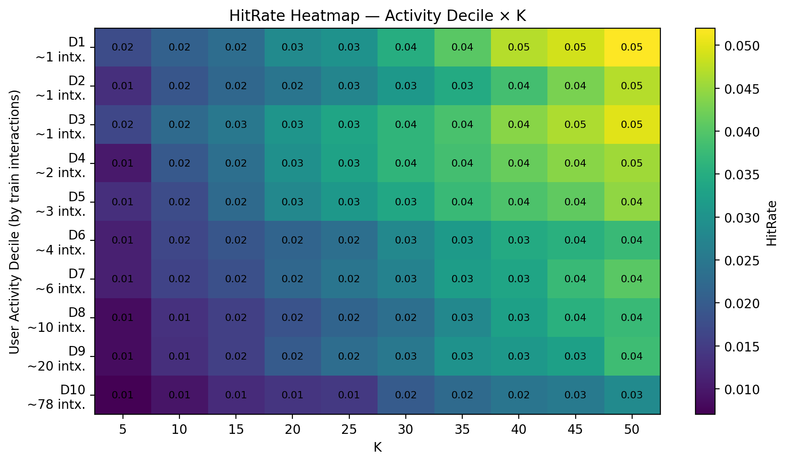

 AI Book Recommender with Mood Detection

“Tell your mood → get the perfect book.”
A hybrid collaborative filtering + popularity recommender on the Book‑Crossing dataset, with simple mood/genre filtering. Ships with tooling to build artifacts, evaluate accuracy, visualize a Hit@K heatmap, and generate personalized recommendations (CSV/JSON/PNG).

 What this repo/notebook does

Builds artifacts from your local Book‑Crossing CSVs + side‑info:

Sparse interactions in HDF5 (CSR).

Encoders/metadata in PKL.

Config in YAML.

Summary in JSON.

Evaluates a baseline model (popularity) with:

Accuracy.png — Hit@K & Precision@K curves.

Heatmap.png — HitRate across user‑activity deciles × K.

Generates recommendations for a user:

Saves recommendations_USER.csv / .json and Recommendations_USER.png.

Emotion‑driven recommendations:

Type an emotion (e.g., happy, sad, motivated mystery) → get mood‑aligned top‑N books.

All outputs are saved in:

C:\Users\sagni\Downloads\AI Book Recommender with Mood Detection

 Data (local paths used)

Provide these exact files (already on your machine):

C:\Users\sagni\Downloads\archive\Books Data with Category Language and Summary\Preprocessed_data.csv

C:\Users\sagni\Downloads\archive\Book reviews\Book reviews\BX_Books.csv

C:\Users\sagni\Downloads\archive\Book reviews\Book reviews\BX-Book-Ratings.csv

C:\Users\sagni\Downloads\archive\Book reviews\Book reviews\BX-Users.csv

The code robustly reads Latin‑1 / CP1252 encodings common in Book‑Crossing.

 Environment

Install once (in your Python 3.10+ environment):

pip install numpy pandas scipy h5py pyyaml matplotlib

 1) Build artifacts (PKL/H5/YAML/JSON)

Notebook cell: Artifact Builder (you already ran this).
Creates:

bx_artifacts.pkl — encoders (user↔row, ISBN↔col) + aligned metadata arrays.

bx_interactions.h5 — CSR matrices (ratings, ratings_binary) + item/user arrays.

bx_config.yaml — run config + schema.

bx_summary.json — dataset stats and top items/users.

After a successful run, you should see:

[OK] Wrote PKL → ...\bx_artifacts.pkl
[OK] Wrote H5  → ...\bx_interactions.h5
[OK] Wrote YAML → ...\bx_config.yaml
[OK] Wrote JSON → ...\bx_summary.json

All artifacts created successfully ✅
Users: 92,108 | Items: 270,170 | Ratings: 1,031,190 | Density: 0.004144%

 2) Accuracy & Heatmap

Notebook cell: Accuracy graph & heatmap.

What it does:

Holds out one positive per user for test.

Trains a popularity baseline on the remaining data.

Computes Hit@K and Precision@K for K ∈ {5,10,…,50}.

Buckets users by train activity deciles and builds a HitRate heatmap.

Outputs saved:

Accuracy.png — Hit@K & Precision@K curves.

Heatmap.png — decile × K HitRate matrix (this is your README preview image).

If the dataset is huge, it evaluates on up to 20k users for speed.

 3) Predict for a user (with optional mood filter)

Notebook cell: Prediction + Save Results + Chart (fixed CSR normalization).

Loads artifacts.

Selects a target user (auto‑picks an active user if USER_ID=None).

Computes user‑based CF (cosine similarities on implicit binary matrix) and blends with popularity.

Optionally filters by mood/genre (keyword match on book category).

Saves:

recommendations_<USER>.csv

recommendations_<USER>.json

Recommendations_<USER>.png (bar chart)

Tuneables in the cell:

USER_ID   = None     # or "276729" etc.
MOOD_TEXT = ""       # e.g., "mystery", "motivated", "romance"
TOP_N     = 20
SIM_TOPK  = 2000     # neighbors considered
BLEND_W   = 0.85     # CF vs popularity

💬 4) Emotion → Recommendations (interactive)

Notebook cell: Interactive: user types an emotion → recommendations.

Prompts: Enter your emotion / mood:

Maps emotion → genre keywords (customizable mapping).

Same CF+pop blend flow.

Saves files with emotion tag:

recommendations_<emotion>_<user>.csv/.json

Recommendations_<emotion>_<user>.png

Examples:

happy → humor/light/uplifting

sad → drama/literary/poignant

motivated mystery → self‑help/business + mystery/crime blend

If your mood keyword filter returns too few items, the code falls back to all items and prints a warning.

 Results Preview

Include Heatmap.png in your README to showcase evaluation.

Rows: user activity deciles (low → high interactions).

Columns: K values (top‑K cutoffs).

Cells: HitRate — fraction of users whose held‑out book appears in top‑K.

Also include Accuracy.png (Hit@K & Precision@K curves) to show overall retrieval quality.

 How the model works (baseline)

Implicit positives: ratings ≥ 6 are treated as “liked”.

User‑based CF (cosine):

L2‑normalize rows of the binary CSR.

Similarity = dot product (cosine) vs target user.

Score items: sim^T * Rb (neighbor‑weighted sums).

Popularity blend:

score = 0.85 * CF + 0.15 * popularity (configurable).

Excludes already‑seen items for the user.

This baseline is strong, scalable, and easy to extend.

 Next steps (improvements)

Swap popularity baseline with Item‑KNN or ALS (implicit MF).

Add text embeddings (e.g., SBERT) from title/summary for a hybrid model.

Use cover images and build a Streamlit app UI (type emotion → get clickable book cards).

Add a diversity/serendipity penalty to avoid same‑author clusters.

 File outputs summary

All written to:

C:\Users\sagni\Downloads\AI Book Recommender with Mood Detection

File	Description
bx_artifacts.pkl	Encoders (user2idx, isbn2idx), aligned metadata arrays, summary.
bx_interactions.h5	CSR ratings & ratings_binary, arrays for users & items.
bx_config.yaml	Paths, schema, environment info.
bx_summary.json	Dataset stats and top items/users.
Accuracy.png	Hit@K & Precision@K curves.
Heatmap.png	HitRate heatmap (activity decile × K).
recommendations_*.csv/.json	Top‑N results per user/emotion.
Recommendations_*.png	Bar chart of recommendation scores.
 Troubleshooting

Encoding errors on CSVs: the loader already tries latin-1, cp1252, utf-8. If a file still fails, open in a spreadsheet app and re‑save as CSV UTF‑8.

Memory: matrices are sparse CSR; evaluation caps at 20k users. Reduce SIM_TOPK or K list in the accuracy cell to speed up.

Few or no candidates after mood filtering: you’ll see a warning and automatic fallback to all items.

User not found: set USER_ID=None to auto‑pick an active user.

 Notes on privacy & fairness

This project uses public datasets; do not upload private reading histories without consent.

Recommenders can amplify popularity bias; consider diversity & fairness constraints for production.

 Citation (datasets)

Book‑Crossing Dataset — Cai‑Nicolas Ziegler et al.

Side information: “Books Data with Category, Language and Summary” (local preprocessed CSV you provided).

 TL;DR: Quick start

Run the Artifact Builder cell.

Run Accuracy & Heatmap → check Accuracy.png and Heatmap.png.

Run Prediction (optionally set USER_ID / MOOD_TEXT).

Run Emotion → Recommendation and type any mood phrase.
Author

SAGNIK PATRA
